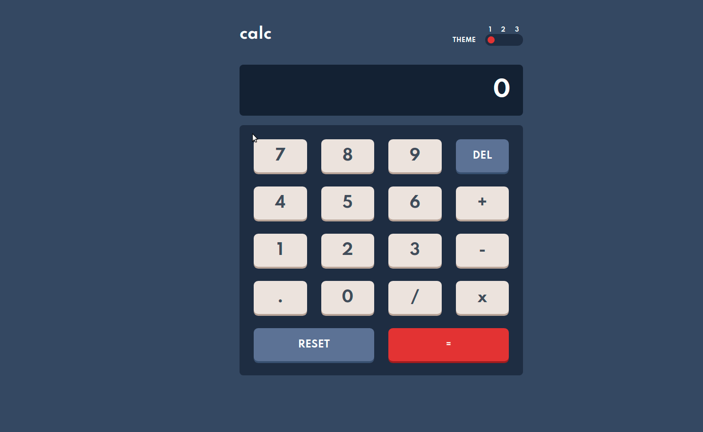

<h1 align="center">
    
    <a href="https://rodrigorvix.github.io/challenges-frontendmentor/calculator-app">CALCULADORA APP</a>
</h1>
<h2 style='text-align:right'><a href=https://github.com/rodrigorvix/challenges-frontendmentor/blob/main/calculator-app/README.md>🇺🇸</a></h2>

 <a href="#📷Demonstração">Demonstração</a> •
 <a href="#ℹ️Sobre">Sobre</a> • 
 <a href="#🔗links">Links</a> • 
 <a href="#🛠tecnologias">Tecnologias</a> • 
 <a href="#📚aprendizado">Aprendizado</a> • 
 <a href="#👨‍💻autor">Autor</a> • 
 <a href="#👏agradecimentos">Agradecimentos</a> 

 

# 📷Demonstração

  

# ℹ️Sobre

Esta é uma solução para o [Desafio do aplicativo Calculadora no Frontend Mentor](https://www.frontendmentor.io/challenges/calculator-app-9lteq5N29). Os desafios do Frontend Mentor ajudam você a melhorar suas habilidades de codificação ao construir projetos realistas.
Neste projeto, os usuários devem ser capazes de:

- Ver o tamanho dos elementos ajustados com base no tamanho da tela de seus dispositivos;
- Realizar operações matemáticas como adição, subtração, multiplicação e divisão;
- Ajustar o tema de cores com base em sua preferência.
    

# 🔗Links

- URL da solução: [Calculadora App](https://rodrigorvix.github.io/challenges-frontendmentor/calculator-app/)
    

# 🛠Tecnologias

As seguintes ferramentas foram utilizadas na construção do projeto:

- [HTML5](https://developer.mozilla.org/en-US/docs/Glossary/HTML5)
- [CSS3](https://developer.mozilla.org/pt-BR/docs/Web/CSS)
- [JavaScript](https://developer.mozilla.org/pt-BR/docs/Web/JavaScript)
- [Flexbox](https://developer.mozilla.org/pt-BR/docs/Web/CSS/CSS_Flexible_Box_Layout/Basic_Concepts_of_Flexbox)
- [CSS Grid](https://developer.mozilla.org/pt-BR/docs/Web/CSS/CSS_Grid_Layout)
    

# 📚Aprendizado

Neste projeto, tive como principais desafios a utilização dos seguintes recursos:

- criação do seletor de temas
- construir os botões utilizando CSS Grid
- uso da propriedade [HTMLElement.dataset](https://developer.mozilla.org/pt-BR/docs/Web/API/HTMLOrForeignElement/dataset) ;
- reutilização de código.
    

# 👨‍💻Autor

- [Linkedin](https://www.linkedin.com/in/rodrigovitoriense/)
- [Projects Frontend Mentor](https://www.frontendmentor.io/profile/rodrigorvix)
    

# 👏Agradecimentos

Agradeço ao Frontend Mentor (https://www.frontendmentor.io/) por disponibilizar o design para o desafio.
